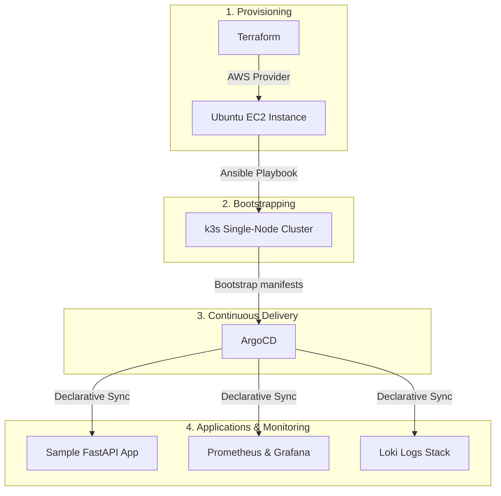

# k3s-starter

A documented, reproducible, production-like k3s cluster provisioned via Terraform, configured via Ansible, deployed to via GitOps, and observable end-to-end.

## Architecture Summary

This project automates the provisioning, configuration, and management of a k3s Kubernetes cluster on AWS. The deployment pipeline follows a strict dependency order:
1. **Terraform** provisions the cloud infrastructure (VPC, Security Groups, and EC2 instances).
2. **Ansible** bootstraps the OS, configures requirements, and installs the **k3s** cluster.
3. **ArgoCD** is installed to establish the GitOps deployment framework.
4. **Workloads** (such as the sample FastAPI application) and the **Observability Stack** (Prometheus, Grafana, and Loki) are deployed and synced declaratively via ArgoCD.

## Architecture Diagram

## Project Status

> [!NOTE]
> This project is currently in the bootstrapping phase. The directories (`terraform/`, `ansible/`, `bootstrap/`, `kubernetes/`, `scripts/`, `docs/`) have been laid out, but no implementation code is active yet.

Below is the implementation checklist aligned with [ROADMAP.md](ROADMAP.md):

### Phase 1: Infrastructure Provisioning
- [ ] Set up Terraform configurations for EC2 and VPC
- [ ] Configure remote state with S3 and DynamoDB
- [ ] Parameterize variables (instance type, region, key pair)
- [ ] Document clean-up procedures (`terraform destroy`)

### Phase 2: k3s Installation
- [ ] Write Ansible playbook to bootstrap k3s on provisioned hosts
- [ ] Ensure playbook execution is idempotent
- [ ] Automatically pull kubeconfig back to the local development machine
- [ ] Document kubectl verification commands

### Phase 3: CI/CD Validation
- [ ] Add GitHub Actions workflow for linting Terraform and Ansible code
- [ ] Add validation to run `terraform plan` on Pull Requests

### Phase 4: Sample FastAPI Deployment
- [ ] Containerize and publish a simple FastAPI application
- [ ] Write Kubernetes manifests (Deployment, Service, Ingress)
- [ ] Manually deploy and verify path routing through Traefik ingress

### Phase 5: GitOps Setup (ArgoCD)
- [ ] Deploy ArgoCD to the k3s cluster
- [ ] Transition FastAPI manifests to ArgoCD tracking
- [ ] Verify automatic synchronization on git commit

### Phase 6: Metrics Observability
- [ ] Deploy `kube-prometheus-stack` via ArgoCD
- [ ] Expose Grafana dashboards for node and cluster metrics
- [ ] Create a custom Grafana dashboard tracking FastAPI request/error rates

### Phase 7: Log Aggregation
- [ ] Deploy Grafana Loki and Promtail/Alloy via ArgoCD
- [ ] Configure log parsing and query sample logs within Grafana

### Phase 8: Final Review & Docs
- [ ] Create a robust getting-started guide under `docs/`
- [ ] Document known limitations (e.g., single-node architecture, no TLS/cert-manager)
