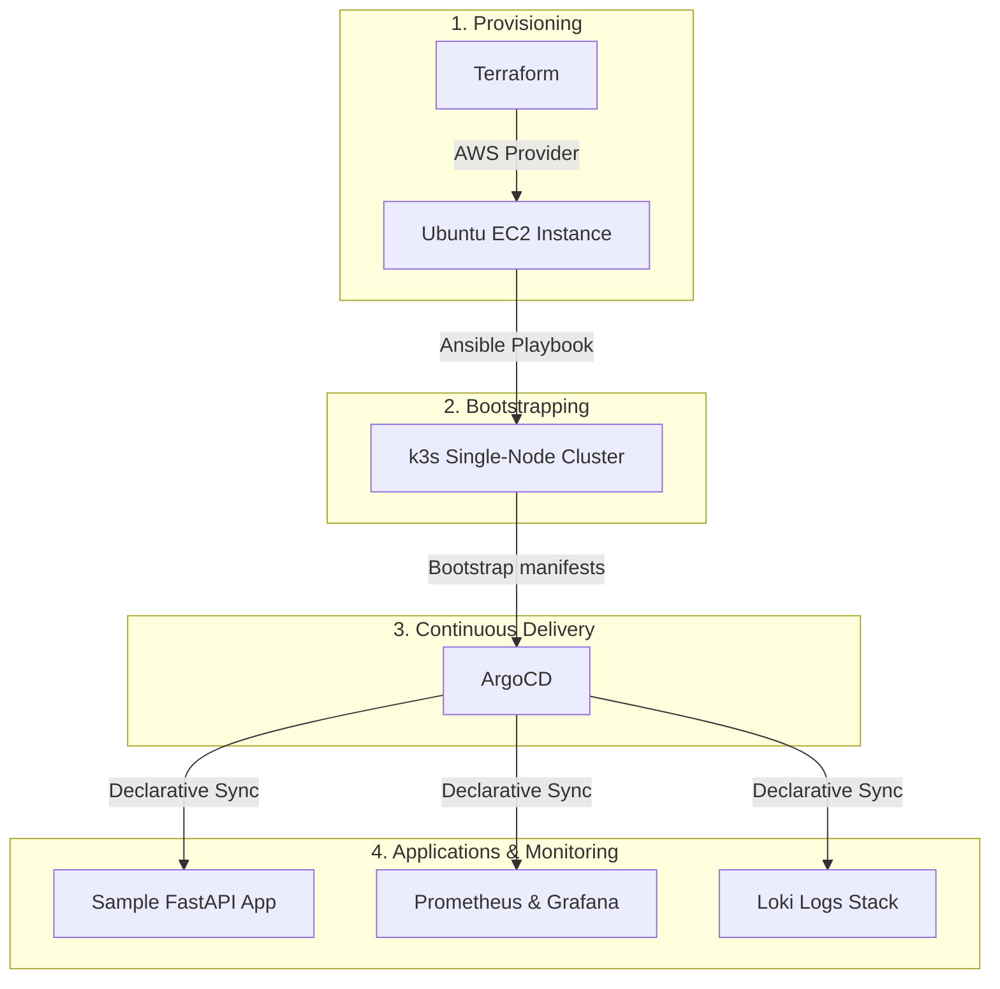

# k3s-starter

A documented, reproducible, production-like k3s cluster provisioned via Terraform, configured via Ansible, deployed to via GitOps, and observable end-to-end.

## Architecture Summary

This project automates the provisioning, configuration, and management of a k3s Kubernetes cluster on AWS. The deployment pipeline follows a strict dependency order:
1. **Terraform** provisions the cloud infrastructure (VPC, Security Groups, and EC2 instances).
2. **Ansible** bootstraps the OS, configures requirements, and installs the **k3s** cluster.
3. **ArgoCD** is installed to establish the GitOps deployment framework.
4. **Workloads** (such as the sample FastAPI application) and the **Observability Stack** (Prometheus, Grafana, and Loki) are deployed and synced declaratively via ArgoCD.

## Architecture Diagram

## Project Status

> [!NOTE]
> This project has successfully completed its bootstrapping and development roadmap! The cluster is fully automated from infrastructure provisioning to application observability.

For full documentation, please refer to:
- [Getting Started Guide](docs/getting-started.md)
- [Known Limitations](docs/limitations.md)

Below is the completed implementation checklist aligned with [ROADMAP.md](ROADMAP.md):

### Phase 1: Infrastructure Provisioning
- [x] Set up Terraform configurations for EC2 and VPC
- [x] Configure remote state with S3 and DynamoDB
- [x] Parameterize variables (instance type, region, key pair)
- [x] Document clean-up procedures (`terraform destroy`)

### Phase 2: k3s Installation
- [x] Write Ansible playbook to bootstrap k3s on provisioned hosts
- [x] Ensure playbook execution is idempotent
- [x] Automatically pull kubeconfig back to the local development machine
- [x] Document kubectl verification commands

### Phase 3: CI/CD Validation
- [x] Add GitHub Actions workflow for linting Terraform and Ansible code
- [x] Add validation to run `terraform plan` on Pull Requests

### Phase 4: Sample FastAPI Deployment
- [x] Containerize and publish a simple FastAPI application
- [x] Write Kubernetes manifests (Deployment, Service, Ingress)
- [x] Manually deploy and verify path routing through Traefik ingress

### Phase 5: GitOps Setup (ArgoCD)
- [x] Deploy ArgoCD to the k3s cluster
- [x] Transition FastAPI manifests to ArgoCD tracking
- [x] Verify automatic synchronization on git commit

### Phase 6: Metrics Observability
- [x] Integrate `prometheus-fastapi-instrumentator` into the sample app
- [x] Deploy `kube-prometheus-stack` via ArgoCD
- [x] Expose Grafana externally via Traefik ingress
- [x] Create and auto-provision a custom Grafana dashboard for FastAPI RED metrics

### Phase 7: Log Aggregation
- [x] Deploy Grafana Loki and Promtail/Alloy via ArgoCD
- [x] Configure log parsing and query sample logs within Grafana

### Phase 8: Final Review & Docs
- [x] Create a robust getting-started guide under `docs/`
- [x] Document known limitations (e.g., single-node architecture, no TLS/cert-manager)
- [x] Update architecture diagrams and link to CineMate repository (if applicable)
